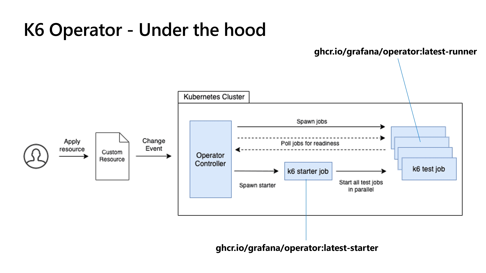

# Introduction
Execute [K6](https://k6.io)-based tests (load, performance and end-to-end) on Azure Kubernetes Service [AKS](https://azure.microsoft.com/en-us/products/kubernetes-service)

---
> [!TIP]
> Scripts are only for demonstrating purposes.


# Architecture 
## Microsoft Azure Services

## K6 Operator


# Getting Started

If you have already an AKS cluster or you would like to provision one from Azure Landing Zone Accelerator (https://azure.github.io/AKS-Construction/) then you should proceed directly with the [2. Manual Installation](#2-manual-installation)

## 1. Installation process
Use Azure DevOps pipelines located in the .pipelines folder to deploy the cluster, build the docker images and install the test framework in fully automated way. The pipelines are as follow:
- [Deploy-test-framework-JMeter](.pipelines/deploy-test-framework.yml) provisions the AKS cluster, builds and pushes the images, installs cert-manager and deploys the helm chart on the cluster in one step.
- [K6-extension](.pipelines/k6-build-push-extension.yml) builds K6 extension images to digest telemetry data to InfluxDB.
- [Install-k6-operator](.pipelines/install-k6-operator.yml) installs K6-operator [K6-operator](https://github.com/grafana/k6-operator) into your AKS cluster.
- [Execute-k6-test](.pipelines/execute-k6-test.yml) executes K6 test script with the defined parameters (number of virtual users, number of parallelism, etc) in the cluster

## 2. Manual Installation
It is highly recommended to use the Azure DevOps Services pipelines to deploy the solution.
If you still would like to create it manually, then you should consider the following steps:

- Use the ARM template available under the arm folder to deploy your AKS cluster manually:  [infrastructure_deployment.json](/arm/infrastructure_deployment.json). This deploys an AKS cluster based on the pre-defined parameters to your subscription. IaC script also creates an Azure Managed Grafana Service. In order to grant access to your account or AAD group, you need to query the AAD object id and pass it over a parameter to the deployment script Use az cli ([az](https://github.com/Azure/azure-cli)) to spin up infrastructure: 
```bash
    az group create --name $(resourceGroup) --location $(location)
    az deployment group create --name $deploymentName -g $(resourceGroup) --template-file ./arm/infrastructure_deployment.json \
        --parameters acrName=$(containerRegistry) acrAdminUserEnabled=false acrSku=$(containerRegistrySKU) applicationGatewayDNSPrefixName=$(AppGwPrefixName) \
            grafanaAdminUserOrGroupID=$(grafanaAdminId)
 ```
- Build the reporter docker image ([Dockerfile](/docker/reporter/Dockerfile)) and push to the deployed Azure Container Registry
```bash
   az acr build -g $(resourceGroup) --registry $(containerRegistry) --image testframework/reporter:$(Build.BuildId) .
 ```
- Update the values ([values.yaml](/helm/loadtest_config_chart/values.yaml)) of the HELM chart based on your infrastructure
- Execute [installcertmanager.sh](/deployment/installcertmanager.sh) to install SSL cert management for Application Gateway Ingress Controller ([AGIC](https://learn.microsoft.com/azure/application-gateway/ingress-controller-overview))
- Execute [deploy_test_k6_framework.sh](/deployment/deploy_test_k6_framework.sh) to deploy the HELM chart containing Grafana and InfluxDB
- Execute [postdeployment.sh](/deployment/postdeployment.sh) to configure InfluxDB and Grafana dashboards
- Build Docker container image [xk6-influxdb](/k6/xk6-influxdb/Dockerfile) and push it to the Azure Container Registry
- Install K6-operator (more details [here](https://github.com/grafana/k6-operator))
```bash
    git clone --branch v0.0.8 https://github.com/grafana/k6-operator
    cd k6-operator
    make deploy  
```
- Run tests by creating your K6 kind Kubernetes deployment files.

## 3. Software dependencies

- Grafana
- InfluxDB
- K6-Operator
- XK6-Extensions


## 4. Use-case: K6-based load testing on AKS
K6 uses a the Kubernetes operator model to extend Kubernetes default capabilities:


The operator pattern is a way of extending Kubernetes so that you may use custom resources to manage applications running in the cluster. The pattern aims to automate the tasks that a human operator would usually do, like provisioning new application components, changing the configuration, or resolving problems that occur.



The operator will listen for changes to, or creation of, K6 custom resource objects. Once a change is detected, it will react by modifying the cluster state, spinning up k6 test jobs as needed. It will then use the parallelism argument to figure out how to split the workload between the jobs using execution segments.

### K6 Test Script
```js
import http from 'k6/http';
import { check } from 'k6';
export let options = {
  stages: [
    { target: 200, duration: '30s' },
    { target: 0, duration: '30s' },
  ],
};
export default function () {
  const result = http.get('https://test-api.k6.io/public/crocodiles/');
  check(result, {
    'http response status code is 200': result.status === 200,
  });
}
```
This test file should be available inside the cluster in order that K6 operator can spread it out to all pods. The easiest way to make it available is to use ConfigMap, like the following snippet creates one:
```azurecli
kubectl create configmap crocodile-stress-test --from-file $(System.DefaultWorkingDirectory)/test.js --namespace $(namespace) --dry-run=client -o yaml | kubectl apply -f -       
```

### K6 Custom Kind
Using the K6 Custom Resource to let operator spin up K6 test pods is realized by the following YAML specification: 
```yml
---
apiVersion: k6.io/v1alpha1
kind: K6
metadata:
  name: k6-sample
  annotations: 
   prometheus.io/scrape: 'true'
   prometheus.io/port: '5656'
spec:
  parallelism: 4
  script:
    configMap:
      name: "crocodile-stress-test"
      file: "test.js" 
  ports:
  - containerPort: 5656
    name: metrics
  arguments: 
    --out influxdb=http://jmeter-influxdb.framework.svc.cluster.local:8086/k6db 
    --stage 2m:10,1m:0
  runner:
    image: k6fdpoacr.azurecr.io/k6/xk6-influxdb:latest
    resources:
      limits:
        cpu: 200m
        memory: 1000Mi
      requests:
        cpu: 100m
        memory: 500Mi
    metadata:
      annotations:
        prometheus.io/scrape: 'true'
        prometheus.io/port: '5656'
  
```

**Please note the custom Docker image that is used in runner scope.**
This image uses so called K6 extension ([xk6](https://github.com/grafana/xk6)) to feed K6 test execution data to InfluxDB in real time: [xk6-output-influxdb](https://github.com/grafana/xk6-output-influxdb )


Final dashboard with some loads against https://test-api.k6.io/public/crocodiles/  


To execute your own test script you need to:
- create a ConfigMap containing your test script
- create K6 kind artifact (yaml file)
- deploy the yaml file via *"kubectl apply -f"*


# **Contribute**
Please feel free to reuse these samples. If you think, there are better approaches to accomplish these jobs, please share with us.
